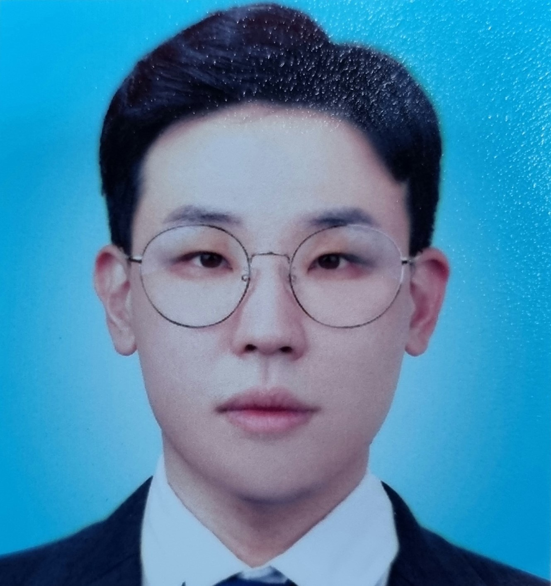

    <h1 class="notion-title"> 김평강 | 화이트 햇 해커</h1>

    <h2>😎 Introduce</h2>
     
        
    <!-- 

 -->
    

       <!-- 자기소개 작성 -->
    

    

        <h2>🏫 Education</h2>
            <li> 광주 숭의고등학교 졸업 
                <ul> (2007년 졸업 | 컴퓨터 전자 전기과)</ul>
            </li>
            <li> 목포대학교 졸업 (학사)
                <ul> (2014년 졸업 | 제어로봇 공학과)</ul>
            </li>
            <li> 목포대학교 졸업 (석사)
                <ul> (2017년 졸업 | 정보보호기술학협동과정)</ul>
            </li>
            <li> 모의해킹 실무 온라인 과정 
                <ul> (보안프로젝트 온라인 과정) 
                    GM SHOP 대상 웹 취약점 분석 
                    OpenVas를 통한 취약점 분석 
                    XSS 취약점 분석 등을 실무 보고서 작성 형식으로 이수 
                    Kubernetes 환경에서 취약점 분석 
                    AWS 환경 구축 경험 
                </ul>
            </li>    
            <li> 스마트미디어인재개발원
                <ul> (2020년 수료 | 지역전략산업기반 빅데이터 서비스 개발자과정) 
                    - 1차 프로젝트 :  관심사 기반 소모임 추천 서비스 
                    (자바를 활용하여 UI 설계 , 데이터베이스와 자바 연동) 
                    - 2차 프로젝트: 자리배치 시스템  
                    (머신러닝을 사용하여 성격 분석, 이력서 데이터 크롤링하여 라벨링) 
                    - 3차 프로젝트: openpose를 사용한 근골격계 예방 서비스 
                (알고리즘 설계 , 배치 파일 설계 , Openpose 환경설정)
                </ul>
            </li>
    
        
    
            
        <h2>💼 Work Experiance </h2>
            <li> 삼영시스템 : 델파이를 활용한 무인발매기 개발 및 유지보수
                <ul> 사원 | 2014.04 ~ 2014.09 </ul>
            </li>
            <li> 지오정보기술 : 자바스크립트를 활용한 스마트 ATM UI 설계
                <ul> 프리랜서 | 2019.02 ~ 2019.04 </ul>
            </li>
            <li> 레드원테크놀러지(주) : 인공지능응용팀 
                <ul> 연구원 | 2021.04 ~ 2023.01 </ul>
            </li>        
    
            

     

    <h2>📚Tech Stack</h2>
    
✨Languages and Tools 

    
    
    
    
    
    
    
    

 

    <h2>📋 Project</h2>
    <ol>
        <li>
            <a href="https://github.com/pk3313/pk3313/tree/main/Project_A"><h3>수중로봇 네비게이션 시스템</h3></a>
            무인 잠수정(ROV) 수중 환경 위치 추정을 위해 센서를 이용한 네비게이션 시스템 개발 프로젝트 
            개발 기간 : 2021.09 ~ 2023.11 
             
            기술 스택 : 
            Ubuntu, Python, Socket, Numpy        
        </li>
         
        <li><a href=""> <h3>어린이집 교육용 로봇 </h3></a>
            아동-로봇 간 상호작용 프로그램 제작 프로젝트 
            개발 기간 : 2021.05 ~ 2023.1   
            기술 스택 : 
            STT & TTS, Transformer, Python, Ubuntu</ul>
        </li>    
    </ol>

<!-- 
    <li>프로젝트 명 : 수중 로봇 네비게이션 시스템 
        <ul> 
            - 담당 역할 : DVL, FOG, Depth, Altimeter 데이터를 활용한 시각화 및 위치추정, 좌표 계산 프로그램 
            - 기술 스택 : Ubuntu, Python, Socket, Numpy 
            - 업무 기간 : 2021.09 ~ 2022.11  
            - 상세 내용 :  
            <ul>
                - 무인잠수정(ROV)의 수중 환경 위치 추정을 위해 센서를 이용한 네비게이션 시스템 개발 프로젝트로, 센서 데이터 통신 및 ROV 위치 추정, 시각화를 담당 
                - 도분초 좌표계 코드를 사용중인 프로그램의 형식에 맞게 변경하는 코드를 작성하여 네비게이션 프로그램에 출력해주는 프로그램을 제작 
                - socket통신 코드를 작성하여 로봇 및 센서 간의 올바른 통신이 이루어 지는 지 체크하는 코드를 작성 
                - GPS 데이터를 받아와 센서로 데이터를 전송하는 코드 작성을 담당 
            </ul>
        </ul>
    </il>
    <li>프로젝트 명 : 어린이집 교육용 로봇 
        <ul> 
            - 주요 업무 : 백엔드 및 실무 담당자 
            - 담당 역할 : 로봇간 상호작용 프로그램 제작, QnA 생성 프로그램 제작, Corpus 제작, 실무 담당자 
            - 업무 기간 : 2021.05 ~ 2023.1  
            - 상세 내용 :  
            <ul>
                - STT & TTS를 활용한 로봇 간 상호작용 프로그램 작성 , Transformer 모델을 활용한 QnA 생성, 질문 생성을 위한 Corpus 프로그램 제작 등을 담당 및 실무 담당자로서 프로젝트를 주도 
                - 어린이 대화를 위한 Corpus 제작을 위해 어린이 데이터를 수집하는 Crawling 코드를 작성하여 어린이 데이터를 수집  
-->

<!--
**pk3313/pk3313** is a ✨ _special_ ✨ repository because its `README.md` (this file) appears on your GitHub profile.

Here are some ideas to get you started:

- 🔭 I’m currently working on ...
- 🌱 I’m currently learning ...
- 👯 I’m looking to collaborate on ...
- 🤔 I’m looking for help with ...
- 💬 Ask me about ...
- 📫 How to reach me: ...
- 😄 Pronouns: ...
- ⚡ Fun fact: ...
-->
